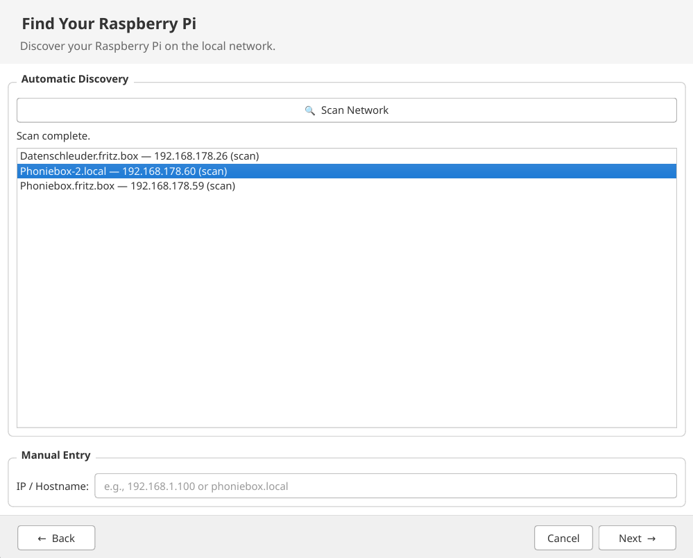
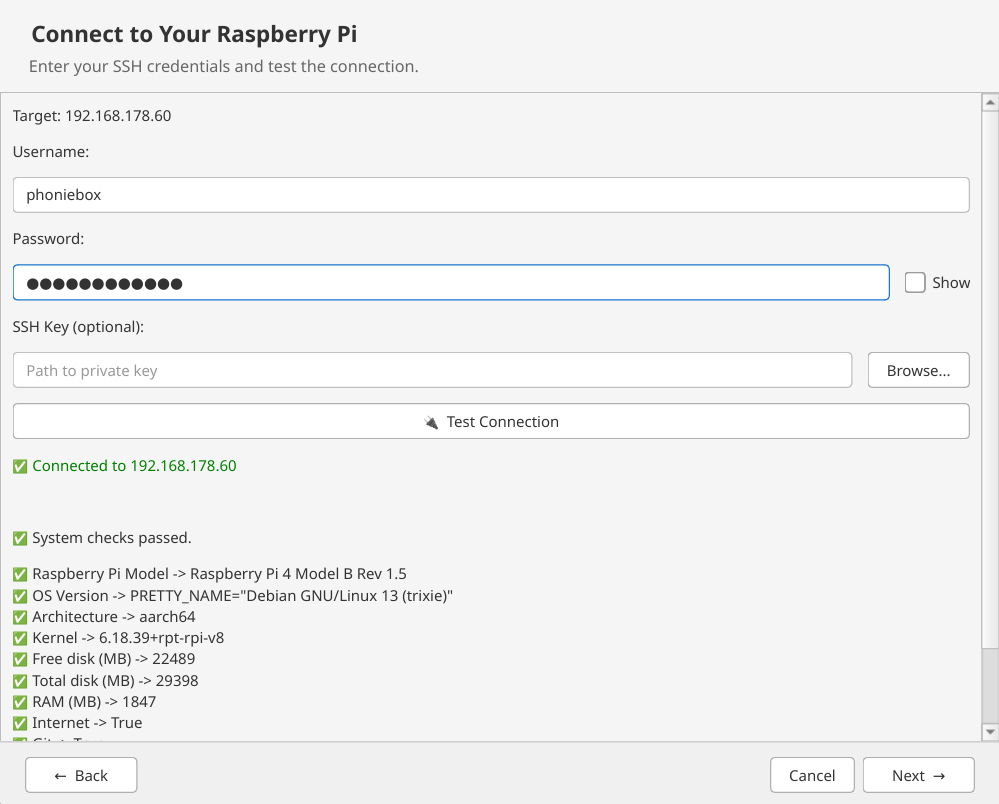
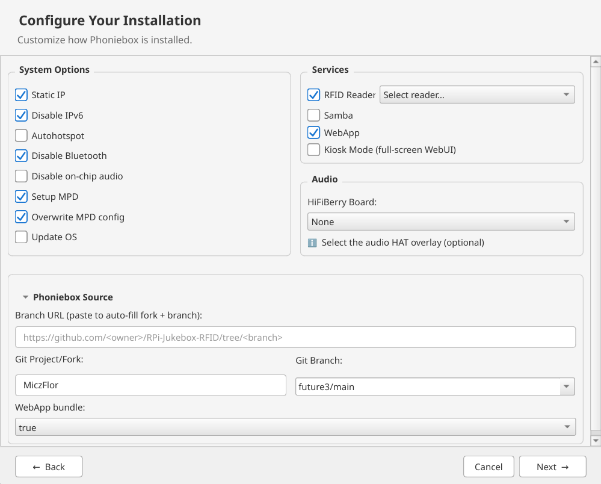
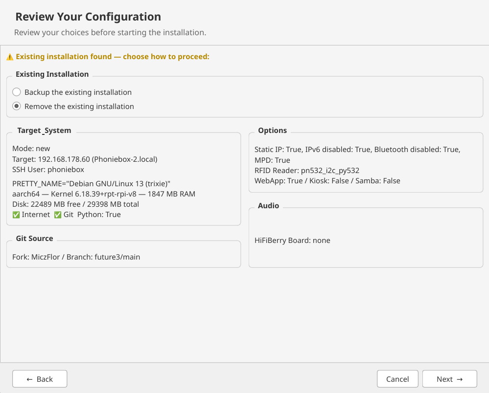
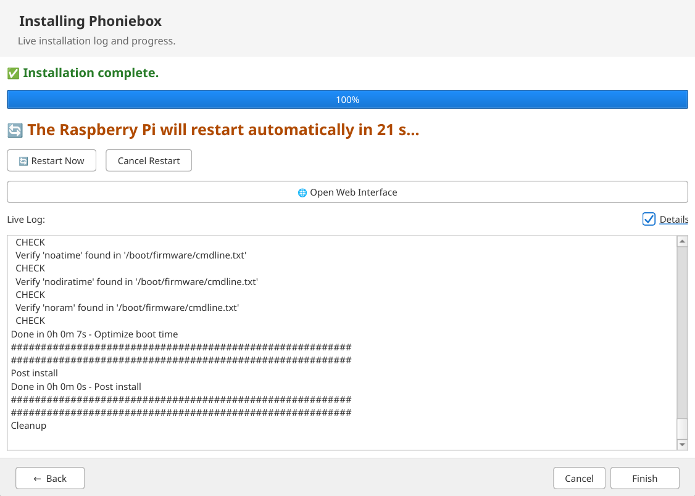

# Phoniebox Installer

A cross-platform graphical installer (Windows & Linux) for
[RPi-Jukebox-RFID (Phoniebox future3)](https://github.com/MiczFlor/RPi-Jukebox-RFID).

Built with Python, PySide6 (Qt), and Paramiko. The installer connects to a
Raspberry Pi over SSH, runs pre-flight system checks, lets the user configure
the installation, and executes the Phoniebox install scripts non-interactively
(flat `KEY=VALUE` config + `install-jukebox.sh --config`).

## What it does

The installer walks you through a six-step wizard:

1. **Welcome** — choose the installation mode. A fresh installation is fully
   supported; updating an existing Phoniebox is shown as "coming soon".
2. **Find your Raspberry Pi** — the Pi is discovered automatically on the local
   network via mDNS (Bonjour, `_ssh._tcp.local.`) and a parallel port scan for
   SSH (port 22); results are de-duplicated. You can also enter an IP address or
   hostname manually.
3. **Connect to the Pi over SSH** — password or optional private-key
   authentication with a live connection test. Host keys use trust-on-first-use:
   unknown hosts show a fingerprint prompt, changed keys are flagged. After
   connecting, pre-flight checks run automatically on the Pi and show: model,
   OS version (must be Debian/Raspbian-based), architecture, kernel, free/total
   disk, RAM, internet access, git, Python ≥ 3.9, and whether a Phoniebox is
   already installed (plus its version). Critical failures block the wizard.
4. **Configure the installation** — pick the Phoniebox source (GitHub fork +
   branch, with branch auto-completion from the GitHub API and paste-able branch
   URLs), the web-app bundle mode, and the options:

   - **System:** static IP, disable IPv6, autohotspot, disable Bluetooth,
     disable on-chip audio, update the OS.
   - **MPD:** set up the Music Player Daemon and optionally overwrite its
     config.
   - **Services:** RFID reader (choose reader type: PN532, RC522, RDM6300,
     MFRC522, generic NFC/USB), Samba, web app, kiosk mode.
   - **Audio:** select a HiFiBerry board (DAC+, Digi, DAC, Amp).

5. **Review** — summary of all choices. If an existing installation was
   detected, you decide whether to back it up or remove it.
6. **Install** — the installer writes a flat `KEY=VALUE` config, uploads it to
   the Pi via SFTP, downloads `install-jukebox.sh` from the selected
   fork/branch and runs it non-interactively with `--config`. The remote output
   is streamed into a live log (a "Details" view tails the remote install log),
   and progress is shown per phase. After success a 30-second countdown reboots
   the Pi (or "Restart Now" / "Cancel Restart"); the installer waits for the Pi
   to come back online and then offers to open the Phoniebox web interface.

## Screenshots

The installer's wizard pages (in the order shown to the user):

### Find Your Raspberry Pi

Automatic discovery via mDNS and SSH port scan, plus manual IP/hostname entry.

<p align="center">
  
</p>

### Connect to Your Raspberry Pi

SSH credentials, live connection test and the automatic pre-flight system
checks.

<p align="center">
  
</p>

### Configure Your Installation

Phoniebox source, system options, services and audio.

<p align="center">
  
</p>

### Review Your Configuration

Summary of all choices, including the backup/remove decision for existing
installations.

<p align="center">
  
</p>

### Installing Phoniebox

Live log and phase progress, followed by the reboot countdown.

<p align="center">
  
</p>

## Development

```bash
# Create a virtualenv and install dependencies
uv venv .venv
uv pip install --python .venv/bin/python -r requirements-dev.txt

# Run the application
.venv/bin/python -m phoniebox_installer.main

# Run tests
.venv/bin/pytest

# Lint
.venv/bin/flake8 phoniebox_installer/ tests/
```

## Building

- **Linux AppImage** — `packaging/linux/build_appimage.sh` (PyInstaller +
  appimagetool). You can build it locally with:

  ```bash
  bash ./packaging/linux/build_appimage.sh
  ```

  This produces `Phoniebox-Installer-<version>-x86_64.AppImage` in the repo
  root. Requirements: the dev dependencies (incl. `pyinstaller`, see
  requirements-dev.txt), the system `file` utility, and `wget` — appimagetool
  is downloaded automatically if it is not already installed. The CI workflow
  runs the same script inside a Debian 12 container so the result is
  deterministic and independent of the developer's system.

- **Windows executable** — `packaging/windows/phoniebox-installer.spec`
  (PyInstaller, produces `dist/Phoniebox-Installer.exe`).

## License

MIT — see [LICENSE](LICENSE).

